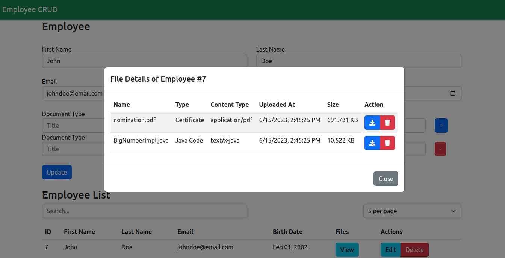

# grails-spa
Simple SPA CRUD using a pretty old version(2.2.5) of grails. But the code should work with latest version of grails too. A simple CRUD for an employee domain is implemented with a File Service to upload multiple files dynamically. 

# Requirements

* JDK 7
* Grails 2.2.5

# Installation
* Clone the repository: `git clone https://github.com/mhhrakib/grails-spa.git`
* Change into the project directory: `cd grails-spa`
* Install dependencies: grails compile
* Start the application: grails run-app

# Features

* Server side pagination with search facilities and simple implementation of datatable used in frontend without any third party library
* File Service for uploading multiple files dynamically and downloading files

# Screenshot

